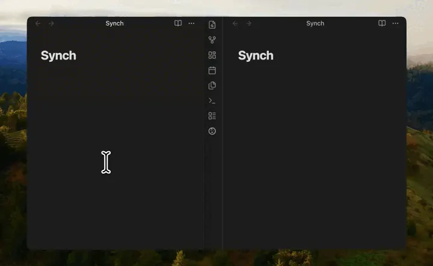

<h1 align="center">Synch</h1>

Obsidian のためのエンドツーエンド暗号化同期。

  <a href="https://synch.run/ja">ウェブサイト</a> ·
  <a href="https://synch.run/ja/self-hosting">Cloudflare デプロイ</a> ·
  <a href="https://synch.run/ja/self-hosting-docker">Docker デプロイ</a>

  
  

  <a href="../../README.md">English</a> |
  <a href="README.ko.md">한국어</a> |
  <a href="README.ja.md">日本語</a> |
  <a href="README.zh-CN.md">简体中文</a> |
  <a href="README.zh-TW.md">繁體中文</a>

  

---

ローカル暗号化、バージョン履歴、競合に安全なファイル処理で、Obsidian Vault を
複数の端末間で同期できます。

Synch は独立したコミュニティプラグインおよびサービスです。Obsidian とは提携して
いません。

## Synch を選ぶ理由

- **プライバシーを重視した設計** — Vault データはアップロード前に端末上で暗号化されます。
- **高速同期** — 変更を頻繁に検出し、端末間で同期します。
- **復元可能** — 暗号化された履歴から以前のバージョンや削除したファイルを復元できます。
- **競合に安全** — 重複しない Markdown 編集は自動的にマージできます。
- **ホスティングを選択可能** — Synch Cloud を使うことも、自分で Synch サーバーを運用することもできます。

## 仕組み

同期サービスは、暗号化されたファイル blob と暗号化された同期メタデータを保存します。
ホストされたサービスが平文のノート、平文のファイルパス、Vault キーを読み取れない
ように設計されています。

## Obsidian の同期オプションを比較

各オプションには、利便性、管理性、設定の手間について異なるバランスがあります。

| オプション | 暗号化 | ストレージモデル | 競合処理 | 適したユーザー |
| --- | --- | --- | --- | --- |
| **Synch** | 端末側 E2EE | Synch Cloud またはセルフホスト | 重複しない Markdown 編集を自動マージ、重複する競合を保持 | シンプルでオープンソース、プライバシー重視のワークフローを求めるユーザー |
| [Obsidian Sync](https://obsidian.md/sync) | デフォルトで E2EE、標準暗号化も利用可能 | Obsidian ホスト | 公式 Obsidian 統合と同期履歴 | 公式ホストサービスを好むユーザー |
| [Self-hosted LiveSync](https://github.com/vrtmrz/obsidian-livesync) | E2EE | セルフホストの CouchDB、オブジェクトストレージ、または任意の WebRTC | 単純な競合を自動マージ | バックエンドを最大限に自分で管理したいユーザー |
| [Remotely Save](https://github.com/remotely-save/remotely-save) | パスワードベースの E2EE を任意で利用可能 | S3、WebDAV、Dropbox、OneDrive、Google Drive など任意のストレージ | 基本的な競合検出、高度なスマート競合処理は Pro で利用可能 | 使いたいストレージプロバイダーがすでにあるユーザー |

この比較は意図的に概要にとどめています。重要な Vault を移行する前に、各プロジェクトの
最新のドキュメントと設定を確認してください。

## 機能

- ほぼ即時の同期
- 暗号化されたバージョン履歴
- 削除ファイルの復元
- Markdown 競合の自動マージ
- 編集が重複した場合の競合コピー
- Markdown ファイルはデフォルトで有効
- 画像、音声、動画、PDF ファイルはデフォルトで有効
- 追加のファイルおよびフォルダ除外
- ホストされた Synch Cloud
- セルフホスト環境用のカスタム API URL
- デスクトップ版およびモバイル版 Obsidian に対応

## はじめに

### Synch Cloud

1. Obsidian で **設定 → Community plugins** を開きます。
2. 制限モードをオフにして **Browse** を選択します。
3. **Synchrun** を検索します。
4. プラグインをインストールして有効化します。
5. Synchrun の設定を開いてサインインします。
6. リモート Vault を作成するか接続します。

接続したら、Synch がローカルの変更をアップロードし、リモートの変更をダウンロード
している間、Obsidian を開いたままにしてください。

### Synch のセルフホスティング

Cloudflare デプロイガイドでは、Synch を自分の Cloudflare アカウントにデプロイします。
Cloudflare を使わない場合は、Docker/systemd ガイドを使用してください。

Synch は次の環境で実行できます。

- Cloudflare
- Docker
- systemd を使う自分のハードウェア

デプロイガイドを参照してください。

- [Cloudflare デプロイ](https://synch.run/ja/self-hosting)
- [Docker/systemd デプロイ](https://synch.run/ja/self-hosting-docker)

デプロイ後、プラグイン設定でカスタム API ベース URL を設定します。

## 安全に関する注意

次の操作を行う前に、必ず Vault 全体をバックアップしてください。

- 新しい同期プロバイダーのインストール
- 別の同期ソリューションからの移行
- 暗号化設定の変更
- リモート Vault のリセットまたは再接続

ファイル監視と競合解決の相互作用を十分に理解していない場合は、同じ Vault に複数の
同期プロバイダーを使用しないでください。

### 開示事項

詳細を表示

このセクションは、Obsidian 開発者ポリシーの審査、およびインストール前にプラグインの
動作を理解したいユーザーのために提供されています。

### アカウント要件

ホストされた同期サービスを使用するには Synch アカウントが必要です。このアカウントは、
デバイスの認証、リモート Vault の作成と接続、同期トークンの発行、ストレージ制限の
適用、サービスアクセスの管理に使用されます。

### ネットワークの使用

Synch は、HTTPS および WebSocket 接続を介して、設定された Synch API ベース URL に
接続します。ホストされたサービスでは、これは Synch が運用するインフラです。既定の
ホスト API エンドポイントは `https://api.synch.run` で、リアルタイム同期は
`wss://api.synch.run` WebSocket 接続を使用します。プラグインは次の目的でネットワーク
リクエストを使用します。

- サインインし、認証済みデバイスセッションを維持する。
- リモート Vault を作成、一覧表示、接続する。
- 暗号化されたファイル blob と暗号化された同期メタデータをアップロードする。
- 暗号化されたファイル blob と暗号化された同期メタデータをダウンロードする。
- WebSocket 接続でリアルタイム同期メッセージを交換する。
- アカウント、請求、クォータ、ストレージ、同期状態を読み取る。

Synch のホストインフラは、Cloudflare などのサードパーティプロバイダーを使用します。
Cloudflare は、ホスティング、ストレージ、ネットワーク、データベース、キュー、関連
インフラに使用されます。請求は Polar によって処理されます。

### Synch に送信されるデータ

Vault ファイルの内容とファイルパスメタデータは、アップロード前にデバイス上で暗号化
されます。Synch は暗号化された blob と暗号化された同期メタデータを保存し、ホストされた
サービスが平文のノート、平文のファイルパス、平文の Vault キーを読み取れないように
設計されています。

エンドツーエンド暗号化は、すべての運用メタデータを隠すものではありません。Synch は、
アカウント情報、Vault 識別子と名前、組織およびメンバーシップ記録、ローカル Vault 識別子、
blob 識別子、ファイルサイズ、ストレージ使用量、タイムスタンプ、同期カーソル、セッション
情報、IP アドレス、User-Agent 文字列、ホストされたサブスクリプションの請求識別子、
および類似の運用メタデータを処理する場合があります。

### ローカル Vault へのアクセス

Synch は、選択された Vault ファイルを同期するために、現在の Obsidian Vault 内のファイルを
読み書きします。プラグイン設定は Obsidian のプラグインデータ API で保存し、デバイス
セッショントークンは Obsidian のシークレットストレージ API で保存し、ローカル同期状態は
ブラウザの IndexedDB に保存します。

Synch は、現在の Obsidian Vault の外にあるファイルを意図的に読み書きしません。

### 支払い

ホストされたサービスでは、無料および有料のサブスクリプションプランを提供しています。
現在の有料ホストプランは Sync Starter で、月払いまたは年払いを利用できます。支払い処理と
サブスクリプション管理は Polar が担当します。

### テレメトリ、広告、プライバシー

Synch Obsidian プラグインにはクライアント側テレメトリは含まれておらず、広告も表示しません。
ホストされたサービスは、サービスの運用、保護、トラブルシューティング、改善に必要な
運用ログとサービスメタデータを処理する場合があります。

詳細については、ホストされたサービスの法的文書をお読みください。

- [プライバシーポリシー](https://synch.run/privacy)
- [利用規約](https://synch.run/terms)

## コントリビューション

Issue、バグ報告、ドキュメントの改善、プルリクエストを歓迎します。

## ライセンス

Synch は [MIT License](../../LICENSE) のもとでオープンソースとして公開されています。
