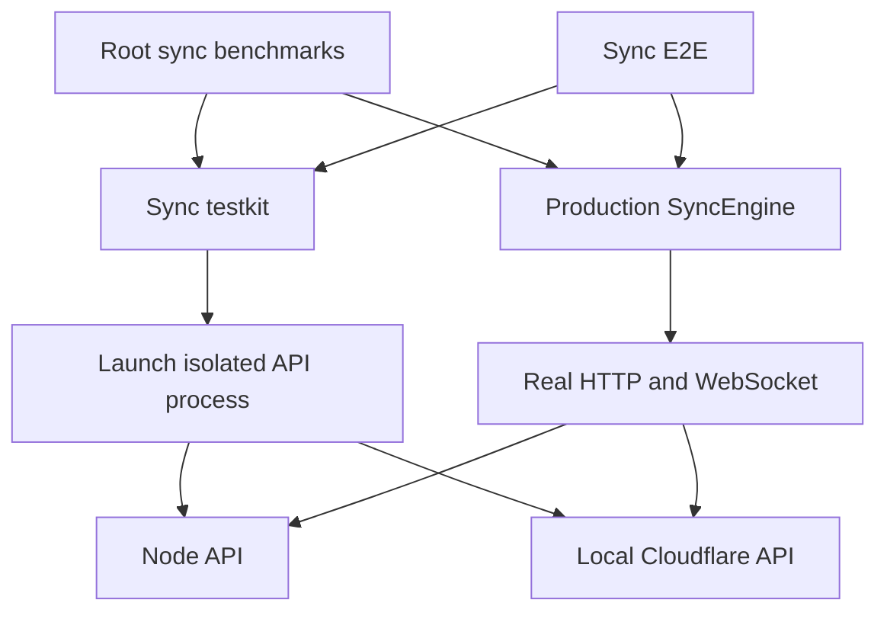

# Sync benchmark architecture

Status: implemented for prepared-session system benchmarks, real-server E2E
provisioning, revision comparison and PR reporting. Two-device propagation,
browser/Dexie and deployed-service tracks remain deferred.

Implementation notes: `server.ts` currently keeps the two small runtime launch
branches together; `fixtures.ts` and `profiles.ts` own the initial workload catalog.
Testkit fault controls remain in the E2E consumer. `cli.ts` owns report identity
collection, and `worker.ts` owns client process RPC. Comparison stages a frozen
measurement driver with pinned tool links into each checkout instead of modifying
its product lockfile. See `benchmarks/sync/README.md` for the runnable interface.

Date: 2026-09-06

## Decision

Own system-level sync benchmarks in `benchmarks/sync`, a private pnpm workspace.
Use real `SyncEngine` clients and the production API over HTTP and WebSocket.
Use local Cloudflare as the default runtime for the hosted product's local
regression measurements; support Node separately for self-hosting. Neither is
a measurement of the deployed Cloudflare service or the Obsidian application.

Share environment provisioning with E2E through a small private
`@synch/sync-testkit` package. Keep E2E assertions and benchmark measurement
lifecycles in their respective consumers. System scenarios and benchmark
fixtures have one owner, even when a focused experiment uses synthetic transport.

The initial implementation uses Node clients, filesystem vaults, and the existing
in-memory client store. Reports must identify all three. Browser workers, Dexie,
Obsidian events, and mobile execution require separate future measurement tracks.

## Findings before migration

- `packages/sync-client/benchmarks/sync-client.bench.ts` combines fixtures,
  synthetic server policy, engine setup, lifecycle, instrumentation, and reporting.
  HTTP calls run directly against the fake server; WebSocket messages use local
  events. Commits update a Map and accept every mutation.
- The existing disk-backed vault is an overlay over reusable fixture files.
  Its copy-on-write behavior differs from a normal mutable vault directory.
- Push preparation calls `reconcileOnce()` and starts the session outside timing.
  The measured operation is `syncNow()`, not change detection through delivery.
- The benchmark prepares multiple runs together, so process RSS can include
  other prepared runs and fake-server work. It cannot represent client-only RSS.
- `tests/sync-e2e/harness/server.ts` already starts isolated production Node and
  local Cloudflare servers, derives Cloudflare bindings from production config,
  applies migrations, and avoids inheriting production credentials.
- E2E's `DeviceNetwork` copies and retains upload/download bodies, retains wire
  messages, and decodes binary responses as text. Its `Device` also uses an
  in-memory vault. Reusing these unchanged would distort large-file measurements.
- The current comparison script executes benchmark definitions from each
  checkout independently and deletes its temporary JSON reports on exit. The PR
  workflow measures only the merge ref, without a same-run baseline comparison.

## Ownership and dependencies



```text
benchmarks/sync/                 @synch/sync-benchmarks; private
  package.json
  README.md
  src/
    cli.ts                      selection, validation, exit status
    runner.ts                   provisioning and sequential sample lifecycle
    sample-worker.ts            one measured client environment
    scenarios/                  prepare, measure, verify for each workload
    fixtures/                   versioned recipes, manifests, expected content
    profiles.ts                 runtime, workload size, transport conditions
    metrics.ts                  bounded counters and completion observations
    report.ts                   versioned JSON and comparison summaries
    compare.ts                  base/candidate orchestration
    experiments/                optional, explicitly synthetic investigations

tests/sync-e2e/
  scenarios/                    correctness and failure/recovery contracts
  harness/device.ts             E2E convenience methods and diagnostics

packages/sync-testkit/           @synch/sync-testkit; private
  src/server.ts                 lifecycle contract and runtime selection
  src/runtime/node.ts           production Node launch
  src/runtime/cloudflare.ts     local Cloudflare launch and migrations
  src/account.ts                signup, vault creation, wrapping/unlocking
  src/transport.ts              real HTTP/WebSocket, optional observation hooks
  src/faults.ts                 opt-in barriers, delays and corruption for E2E

packages/sync-client/            production client and unit tests
  benchmarks/                   only independently useful local microbenchmarks
```

Add `benchmarks/*` to `pnpm-workspace.yaml`. E2E and benchmarks depend on testkit
and the client's public exports; production packages never depend on testkit.
Testkit contains no Vitest assertions, timing statistics, scenario registry,
benchmark datasets, or replicas of API business rules. Do not introduce a common
base class for E2E devices and benchmark devices merely to share construction code.

The server launcher accepts an explicit checkout root and resolves entry points,
tools, assets, migrations, and config from that checkout. This makes base/head
comparison possible without importing API internals. Preserve production config
derivation and temporary storage ownership when moving the existing launcher.
Keep `typescript`/runtime tooling dependencies where the launcher actually needs
them. Consumer dependencies on testkit and sync-client are development-only.

Extract the filesystem adapter or fixture helpers into testkit only when a second
consumer needs them. A benchmark fixture catalog does not belong in a shared
package merely because E2E might use it later.

## Real transport and bounded observation

The shared transport sends real requests and delivers real server responses.
Its default path does not retain request or response bodies. Parse textual API
responses when required by the `HttpClient` contract; preserve blob responses as
binary without additionally decoding or copying them for diagnostics.

Expose optional request/message observation hooks. Benchmarks retain counters,
byte lengths, and timestamps; E2E can explicitly enable ciphertext capture and
corruption. Keep body capture disabled during timed benchmark runs. Diagnostics
must also be bounded rather than appending every event indefinitely.

Transport delay profiles describe the exact boundary they affect: for example,
40 ms before sending each metadata request or 800 ms before sending one attachment
upload. Pass each operation to the real server afterward. These delays model
request scheduling conditions, not shared bandwidth or actual RTT. Do not report
them as measured service latency. A true bandwidth profile needs a separately
validated shared link limiter or network proxy, added only when needed.

Synthetic transports stay inside optional benchmark experiments. Do not make
`fake | node | cloudflare` interchangeable headline benchmark backends: fake-server
results have different semantics and must not enter the system regression table.

## Workloads and completion boundaries

Start with the existing datasets so the migration changes the environment before
introducing new workload questions. Give every workload and timing boundary an
explicit version. An existing fake result is not a baseline for a real-server run.

| Scenario | Prepared state | Measured operation | Completion condition |
| --- | --- | --- | --- |
| Initial pull, 1 GiB | Server seeded; empty receiving filesystem vault; connected client | Release deferred work and pull | Engine drain; receiver has applied target cursor |
| Incremental pull, 64 MiB | Both sides previously synchronized; sender publishes specified changes | Receiver catches up | Engine drain; receiver has applied target cursor |
| Queued push, 1 GiB | Files reconciled into a pending queue; connected client | Release queue and push | Acknowledged work persisted locally; queue empty; engine drain |
| Mixed push | 240 x 4 KiB notes and an 8 MiB attachment, attachment queued first | Push with direct or specified delayed transport | Same push completion, plus per-file completion observations |
| Paginated pull | 500 x 4 KiB notes on server; empty receiver | Pull with direct or metadata-delay profile | Same pull completion |
| Device propagation, subsequent phase | Two connected devices with matching vaults | From an edit submitted through the change source until the peer applies it | Peer completion event plus engine drain |

Use real seeding clients and public API operations to populate remote state.
Incremental receiver state must come from a preceding successful real sync.
Do not fabricate cursors, insert DB rows, or inject encrypted storage snapshots
into the server to accelerate setup. Reuse deterministic plaintext recipes and
expected hashes; produce encrypted objects using the run's actual keys and IDs.

The benchmark owns an ordinary writable filesystem vault per sample. Reusable
source fixtures are copied outside timing. Do not silently retain overlay delete
or rename behavior as if it measured ordinary filesystem operations.

The default track measures prepared sessions. Authentication, connection setup,
fixture materialization, and queued-push reconciliation stay outside timing.
Future connect-and-sync or scan-and-push workloads get separate scenario IDs.
For propagation, local write/event-recording work belongs inside the timed path.

Freeze the expected remote target after seeding and before timing. Gate automatic
work so the receiver cannot pull or the sender push before the start timestamp.
Use engine completion/drain signals, not fixed settling sleeps. Treat a false
`syncNow()` result, any sync error, or a completion timeout as a failed sample.
Queue emptiness alone is insufficient for pull or peer convergence.

After stopping timing, verify file counts, paths, plaintext sizes and hashes,
pending state, and cursor convergence. Verify pushes with an independent receiver
that unlocks through the real wrapper flow. Read and hash files sequentially or
with bounded concurrency; never construct a whole-vault base64 snapshot for 1 GiB.
Record verification failure as failure even when the measured duration looks good.

## Runner and sample isolation

Use a small explicit TypeScript runner for system measurements. Use Vitest for
runner/helper tests and existing package microbenchmarks. Lifecycle control and
cross-process results should not depend on Vitest benchmark setup/teardown modes.
Do not build a generic plugin framework or a separate statistics service.

The parent orchestrator owns temporary roots and child processes. Each measured
sample gets a fresh server data directory, server process, client process, remote
vault, client store, and local vault. Prepare, measure, verify, and dispose that
sample before preparing another. The client worker owns its monotonic timer and
bounded observations, so IPC does not bracket the operation being measured.

Run remote seeding clients outside the measured client's process and close them
before timing, except for an explicitly measured peer in propagation scenarios.
Do not retain seed ciphertext, other devices, or verification snapshots in the
measured client process. A receiver's own preparatory sync for incremental
workloads is part of its declared prepared state.

Start with one discarded rehearsal and five measured samples. Because samples
use fresh processes, rehearsal validates the path but does not promise warm JIT
state in measured processes. Label this policy `fresh-process/prepared-session`.
OS filesystem cache is uncontrolled and is not claimed to be cold. A later
steady-state reuse policy must have a distinct profile and compatible baselines.

Provisioning and verification get separate deadlines and recorded durations.
Server startup and teardown also have bounded timeouts. Close devices and sockets,
terminate the owned process tree, and remove owned temporary storage on success,
failure, or interruption. Keep result JSON and sanitized diagnostics in an output
directory outside temporary cleanup. Do not leave processes holding the next run's
ports or accumulating memory after a failed sample.

Runtime profiles initially cover community-mode Node and local Cloudflare.
Check actual server quota/file limits before provisioning workloads and record
them. Do not bypass limits for a benchmark. Managed billing/policy, deployed
Cloudflare, and browser/Obsidian execution are separate future profiles.

## Metrics and durable results

Use a versioned JSON schema independent of Vitest's output shape. Both CLI and
CI formatting consume this schema. Each report records:

- Source identity: client/API commit, benchmark definition revision, testkit
  revision, dirty-tree identity when applicable, and lockfile fingerprint.
- Workload identity: scenario/version, fixture recipe/version and hash, logical
  bytes/files, ordering rules, timing boundary, and transport profile parameters.
- Environment: OS/architecture, CPU and available parallelism, Node and server
  tool versions, runtime/config fingerprint, client store/vault/hash backend,
  isolation/cache policy, and repetition count. Never dump raw environment vars.
- Raw sample timings, completion status, preparation/verification durations,
  errors, and optional bounded diagnostics; retain unsuccessful samples too.

| Metric | Definition |
| --- | --- |
| `totalMs` | Monotonic duration of the scenario's complete measured boundary |
| `firstCommitAckMs` | First successful commit acknowledgement observed at the client |
| `firstNoteAppliedMs` | First relevant note completion after local acceptance |
| `noteAppliedP95Ms` | Nearest-rank p95 of unique note completion offsets within one sample |
| `uploadCompletedMs` | Selected attachment's successful HTTP completion as observed by client |
| `notesAppliedBeforeAttachmentUploadCompleted` | Completed notes before that HTTP completion |
| Request counts / encrypted body bytes | Actual attempts, including retries; excludes wire headers |
| Effective MiB/s | Scenario's logical changed bytes divided by total duration; not link bandwidth |
| Sampled client RSS | Client process initial/maximum sampled RSS and sampling interval |

The old fake-server `firstCommitMs` observes server application before the ack.
It must not be silently renamed into a real client metric with the same historical
series. Server-side application timing requires explicit server instrumentation
and clock handling; it is not required for the first implementation.

Report sample count, median, min/max, and raw samples. Five runs do not support a
credible run-level p95 claim. Keep per-file p95 separate from run-level variation.
Do not convert missing observations to zero or silently discard slow outliers.
Client RSS excludes server processes but includes the whole client runtime and
may miss short peaks. Server memory is optional and separately attributed; local
Cloudflare can involve multiple processes, so one wrapper PID is not a total.

## Comparing revisions and CI

Default comparisons change client and server together, each from the same source
revision. This answers whether the checkout improves the system. Compatibility
with older deployed servers and client-only attribution are separate experiments.

Run base and candidate sequentially on the same machine with the same benchmark
and testkit definitions. Alternate base/candidate sample order to reduce drift;
do not benchmark both concurrently. Install each checkout using its own lockfile
and record dependency changes as part of the system change under comparison.

Use a pinned measurement definition copied or staged into both isolated checkouts.
Each must resolve the production client and API from its own checkout. Never copy
the candidate production implementation into base. Reject comparison when a public
interface cannot support the same driver, or workload/runtime/timing fingerprints
differ. Report incompatibility instead of printing an apparent speedup. Historical
scenario migrations require an explicit compatible definition, not automatic
editing of the baseline implementation.

Proposed commands, to be added during implementation:

```sh
pnpm bench:sync -- --runtime cloudflare --suite quick
pnpm bench:sync -- --runtime node --suite full
pnpm bench:sync:compare -- --base origin/main --runtime cloudflare --suite quick
```

`quick` selects mixed-push and paginated-pull profiles; `full` adds the existing
1 GiB/64 MiB throughput scenarios. Keep suites fixed and versioned. Validate unknown
arguments rather than silently choosing another runtime. Ordinary recursive unit
tests must not start benchmark servers or generate benchmark fixtures.

Initially preserve the explicit `@synch bench` PR request and manual workflow
trigger. Run base and candidate within each runtime job; show runtime-specific
results without averaging Node and Cloudflare. Use quick workloads first; full
workloads are explicitly selectable. Resolve immutable base and candidate SHAs
before starting. When candidate is the PR merge ref, base is the matching target
branch commit used in that merge, recorded in the report.

CI initially fails for setup, correctness, execution, or invalid-report failures;
performance differences are informational. Add performance gates only after
runner variance and repeatability are characterized, with both relative and
absolute tolerances. If scheduled trends are later useful, add an explicit
scheduled workflow then; this proposal creates no automation.

Preserve the current split between unprivileged benchmark execution and result
publication using trusted default-branch code. Validate artifact schema and size
before formatting. Keep raw results and comparison metadata as artifacts with a
defined retention period (initially 30 days), so PR claims remain inspectable.

## Migration and acceptance criteria

1. Extract server/account provisioning and a capture-free real transport into
   testkit. Keep E2E-specific capture/fault behavior opt-in. Run the unchanged E2E
   scenarios on both runtimes; ciphertext and conflict checks must still pass.
2. Add the root workspace, runner, versioned report, and one paginated-pull
   scenario. Confirm data reaches the real server, complete hash/cursor checks,
   sample isolation, and process cleanup after an intentionally failed operation.
3. Port mixed push, then the three large workloads. Replace fake seeding with real
   clients, bound instrumentation, and preserve documented workload recipes. Run
   every migrated scenario successfully on both runtimes before declaring parity.
4. Implement pinned-definition base/candidate comparison and update the PR workflow,
   formatter, README, and root scripts. Demonstrate retained raw reports, identical
   workload fingerprints, invalid-comparison rejection, and visible failed samples.
5. Remove the old system benchmark, duplicate fixtures, old comparison script,
   obsolete Vitest config and package script/include entries. Retain a synthetic
   experiment only when it answers a documented question beyond the real-server
   suite. Port relevant metrics tests instead of discarding their coverage.

Use separate, reviewable changes for extraction and measurement migration. A
bridge period is allowed, but do not maintain two permanent copies of the same
system scenarios. After migration, root benchmarks own sync performance results,
E2E owns correctness contracts, and testkit owns only reusable execution support.

## Deferred extensions

Add two-device propagation after the prepared-session suite and comparison path
are reliable. Add browser/Dexie measurements when persistence or worker behavior
is the performance question; Node measurements cannot settle those questions.
Add a dedicated deployed environment only when evaluating actual service latency.
Do not introduce distributed load testing, a benchmark database/dashboard, generic
backend plugins, or a second server-policy implementation in the initial work.
